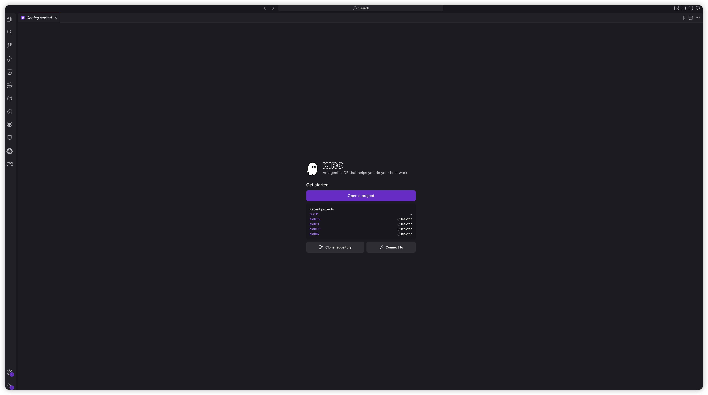
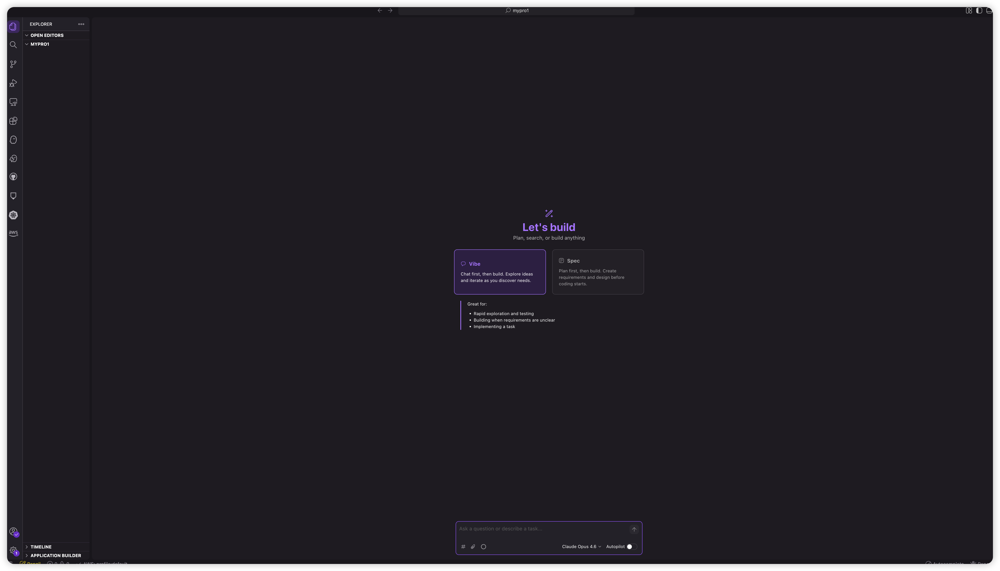
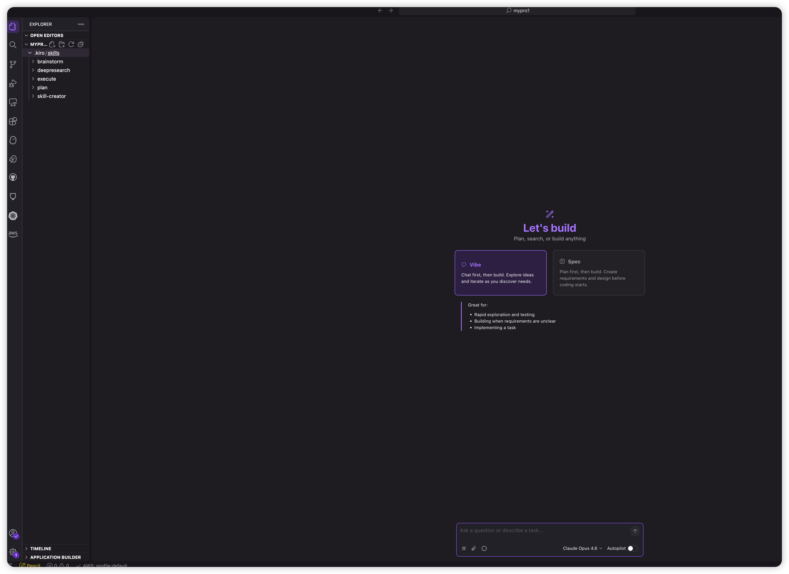
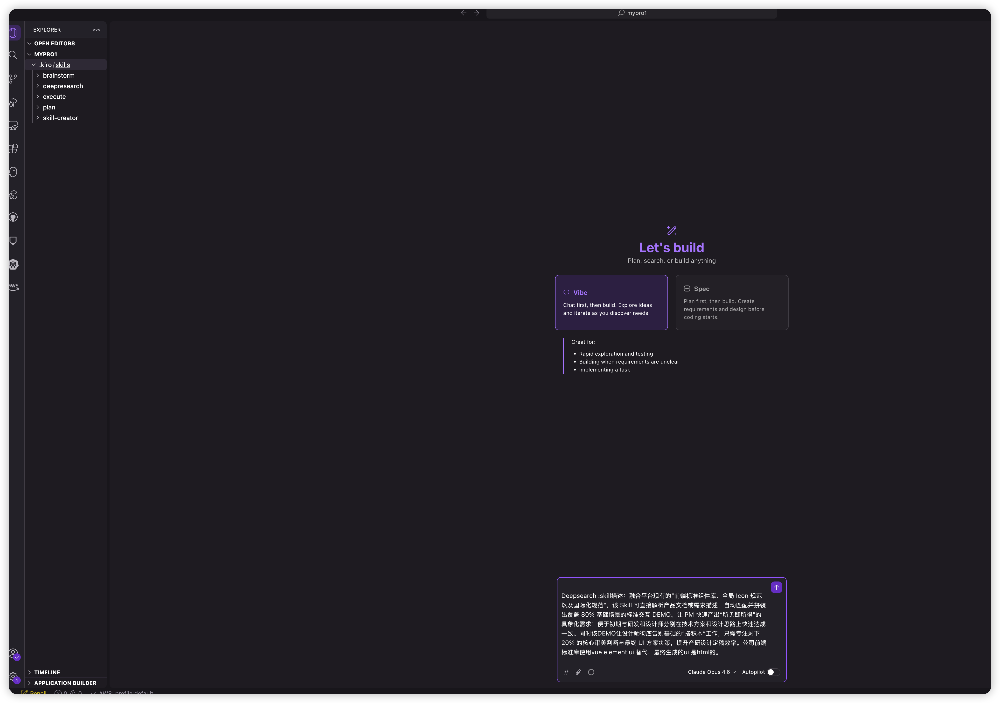
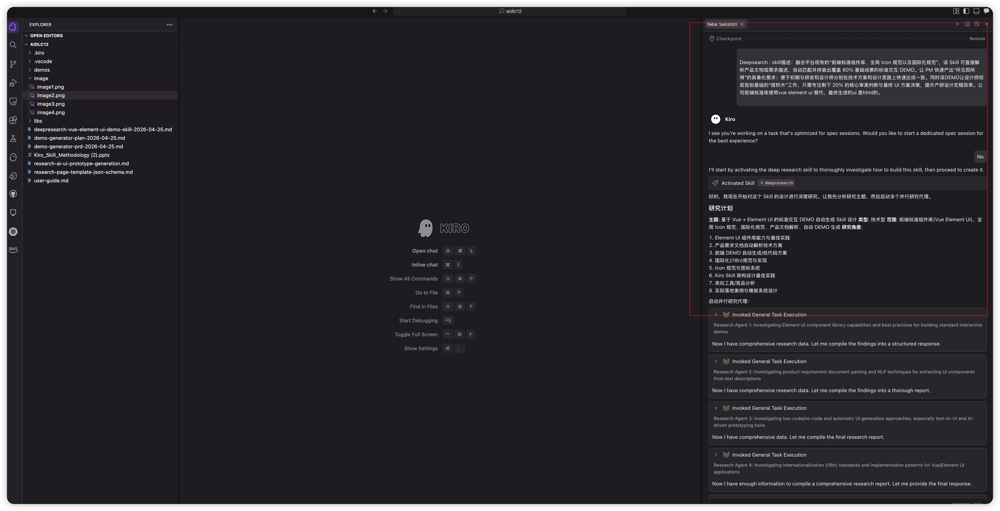
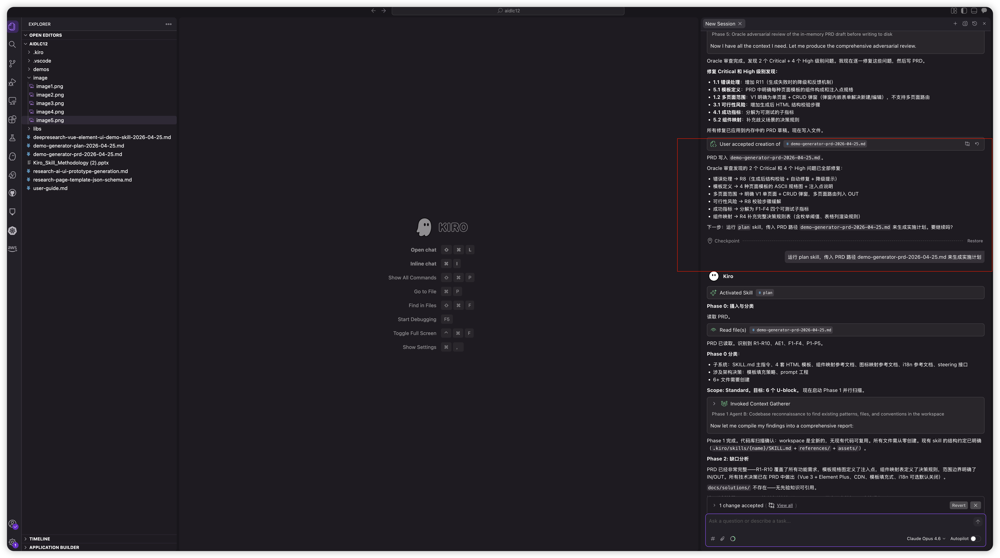

# Element Plus DEMO 自动生成 Skill — 实施指南

> **版本**: V1.0
> **日期**: 2026-04-25

---

## 目录

1. [前置准备](#1-前置准备)
2. [新建项目并部署 Skills](#2-新建项目并部署-skills)
3. [Skill 工作流程总览](#3-skill-工作流程总览)
4. [Step 1：深度研究（Deep Research）](#4-step-1深度研究deep-research)
5. [Step 2：头脑风暴写 PRD（Brainstorm）](#5-step-2头脑风暴写-prdbrainstorm)
6. [Step 3：生成实施计划（Plan）](#6-step-3生成实施计划plan)
7. [Step 4：执行计划（Execute）](#7-step-4执行计划execute)
8. [测试生成的 Skill](#8-测试生成的-skill)
---

## 1. 前置准备

### 1.1 安装 Kiro

确保已安装 Kiro IDE。下载地址：https://kiro.dev

### 1.2 准备 Skill 源文件

前期需要部署 **5 个通用 Skill**，它们驱动从研究到实施的完整流程：

| Skill | 用途 | 触发词示例 |
|-------|------|-----------|
| `deepresearch` | 多代理并行深度研究 | `deepsearch: 主题` |
| `brainstorm` | 研究报告 → PRD 转化 | `brainstorm 写 PRD` |
| `plan` | PRD → 实施计划 | `plan xxx-prd.md` |
| `execute` | 计划 → 并行执行 | `execute plan` |
| `skill-creator` | Skill 创建与优化 | `create skill` |

> **`demo-generator`**（业务专用 Skill）是通过 Step 1-4 的流程自动生成的，不需要预先准备。

---

## 2. 新建项目并部署 Skills

### 2.1 新建项目目录

新建一个项目目录，例如 `mypro1`：

```bash
mkdir mypro1
```

然后打开 Kiro，选择 **Open a Project**，打开刚才创建的 `mypro1` 目录。





### 2.2 创建 Kiro 配置目录结构

在 Kiro 的终端中，创建 `.kiro/skills` 目录：

```bash
mkdir -p .kiro/skills
```

完成后目录结构如下：

```
mypro1/
└── .kiro/
    └── skills/          ← Skill 文件放这里
```

> **注意**：`steering/`（定制配置）、`libs/`（Element Plus 本地资源）和 `demos/`（生成的 DEMO 文件）目录会在后续流程中自动创建，无需手动建立。

### 2.3 复制 Skills 到项目

从源项目中复制 5 个通用 Skill 到新项目的 `.kiro/skills/` 目录：

```bash
# 假设源项目路径为 /path/to/source-project
SOURCE=/path/to/source-project

# 复制 5 个通用 Skill
cp -r $SOURCE/.kiro/skills/deepresearch   .kiro/skills/
cp -r $SOURCE/.kiro/skills/brainstorm     .kiro/skills/
cp -r $SOURCE/.kiro/skills/plan           .kiro/skills/
cp -r $SOURCE/.kiro/skills/execute        .kiro/skills/
cp -r $SOURCE/.kiro/skills/skill-creator  .kiro/skills/
```

> **注意**：`demo-generator` skill 和 `steering/` 配置文件是通过后续 Step 1-4 的流程自动生成的，此时不需要复制。

### 2.4 验证目录结构

复制完成后，项目结构应该是：

```
mypro1/
└── .kiro/
    └── skills/
        ├── brainstorm/
        │   ├── SKILL.md
        │   └── references/
        ├── deepresearch/
        │   └── SKILL.md
        ├── execute/
        │   ├── SKILL.md
        │   └── references/
        ├── plan/
        │   ├── SKILL.md
        │   └── references/
        └── skill-creator/
            ├── SKILL.md
            ├── agents/
            ├── assets/
            ├── eval-viewer/
            ├── references/
            └── scripts/
```

这就是前期准备的全部内容。后续通过 Step 1-4 的流程会自动生成 `demo-generator` skill、`steering/` 配置、`libs/` 资源和 `demos/` 目录。



### 2.5 用 Kiro 打开项目

1. 打开 Kiro IDE
2. 选择 **File → Open Folder**
3. 选择 `mypro1` 目录
4. Kiro 会自动识别 `.kiro/skills/` 下的所有 Skill

> **验证**：在 Kiro 左侧面板的 "Agent Skills" 区域，应该能看到 6 个已加载的 Skill。

---

## 3. Skill 工作流程总览

整个实施过程分为 5 个阶段，每个阶段由一个 Skill 驱动：

```
┌─────────────────────────────────────────────────────────────────┐
│                                                                 │
│  ① Deep Research    →  ② Brainstorm    →  ③ Plan              │
│  "deepsearch:         "brainstorm        "plan                 │
│   研究主题"             写 PRD"             demo-generator       │
│                                            -prd.md"            │
│  输出: 研究报告.md      输出: PRD.md        输出: 计划.md         │
│                                                                 │
│  ④ Execute          →  ⑤ Demo Generator                        │
│  "execute plan"        "生成 DEMO:                              │
│                         订单管理列表页..."                        │
│  输出: Skill 文件       输出: HTML DEMO                          │
│                                                                 │
└─────────────────────────────────────────────────────────────────┘
```

**如果你已经有了 demo-generator skill（即已完成 ①-④），可以直接跳到 Step 5 使用。**

---

## 4. Step 1：深度研究（Deep Research）

### 触发方式

在 Kiro 聊天窗口输入：
提示词需要包含关键字:"Deeepsearch"。不要加入“生成skill”类似词语，这样会跳过brainstorm ,plan 等过程直接执行了。

```
Deepsearch: 融合平台现有的“前端标准组件库、全局 Icon 规范以及国际化规范”，该 Skill 可直接解析产品文档或需求描述，自动匹配并拼装出覆盖 80% 基础场景的标准交互 DEMO。让 PM 快速产出“所见即所得”的具象化需求；便于初期与研发和设计师分别在技术方案和设计思路上快速达成一致。同时该DEMO让设计师彻底告别基础的“搭积木”工作，只需专注剩下 20% 的核心审美判断与最终 UI 方案决策，提升产研设计定稿效率。公司前端标准库使用vue element ui 替代，最终生成的ui 是html的。
```





### 发生了什么

- Skill 自动将研究主题分解为 8 个角度
- 启动 8 个并行研究代理，分别搜索：
  - Element Plus 组件库能力
  - 需求文档解析技术
  - 低代码/AI 生成方案
  - 国际化规范
  - 图标系统
  - 竞品分析（v0.dev, Bolt.new 等）
  - JSON Schema 中间表示层设计
  - Kiro Skill 架构最佳实践
- 交叉验证所有发现
- 生成结构化研究报告

### 输出

文件：`deepresearch-vue-element-ui-demo-skill-YYYY-MM-DD.md`

报告包含：执行摘要、关键发现（带置信度评级）、来源附录。

### 报告生成html（optional）

在完成deepresearch 阶段后，提示词输入：把研究报告做成 html 格式

---

## 5. Step 2：头脑风暴写 PRD（Brainstorm）

### 触发方式

```
brainstorm: 我想做一个 skill 来完成
```



### 交互过程

Brainstorm Skill 会**逐个**问你 5 个关键问题（每次只问一个）：

| # | 问题 | 我们的回答 | 为什么重要 |
|---|------|-----------|-----------|
| Q1 | 公司组件库和 Element UI 的关系？ | **C. Element Plus（Vue 3）** | 决定技术栈 |
| Q2 | 谁是第一使用者？ | **A. PM 自己触发** | 决定 UX 设计方向 |
| Q3 | V1 支持几种页面类型？ | **D. 全部 4 种** | 决定开发范围 |
| Q4 | 公司网络能访问公共 CDN 吗？ | **A. 可以** | 决定资源加载方式 |
| Q5 | 怎么判断成功？ | **A. < 5 分钟出 DEMO** | 决定成功标准 |

### 方案选择

Skill 会生成 3 种方案供选择：

- **方案 A（模板填充式）**：预置 HTML 骨架 + LLM 填充 ← **我们选了这个**
- **方案 B（JSON IR + 代码生成）**：两阶段架构，更灵活但更复杂
- **方案 C（可视化需求规格）**：不生成代码，生成 UI 规格文档

### 输出

文件：`demo-generator-prd-YYYY-MM-DD.md`

PRD 包含：问题陈述、前提、目标用户、成功标准、10 个需求（R1-R10）、4 种页面模板规格、范围边界（IN/OUT）。

### 把 prd 做成 html 格式 (optional)

提示词输入：把 prd 做成 html 格式

---

## 6. Step 3：生成实施计划（Plan）

### 触发方式

```
输入提示词：plan 
```

### 发生了什么

- Plan Skill 读取 PRD，提取所有 R# 需求
- 扫描代码库（确认是全新项目）
- 将需求分解为 6 个实施单元（U1-U6）
- 构建依赖关系 DAG
- 分配并行执行波次

### 输出

文件：`demo-generator-plan-YYYY-MM-DD.md`

计划包含 6 个实施单元：

| 单元 | 内容 | 波次 |
|------|------|------|
| U1 | SKILL.md 主指令文件 | Wave 1（并行） |
| U2 | 页面模板参考文档 | Wave 1（并行） |
| U3 | 组件映射参考文档 | Wave 1（并行） |
| U4 | 图标映射参考文档 | Wave 1（并行） |
| U5 | i18n 模式参考文档 | Wave 1（并行） |
| U6 | Steering 定制配置 | Wave 2（依赖 U1） |


---

## 7. Step 4：执行计划（Execute）

### 触发方式

```
输入提示词：execute
```

### 发生了什么

- Execute Skill 读取计划，验证 DAG 结构
- **Wave 1**：并行派发 5 个子代理，同时创建 U1-U5 的文件
- **Wave 2**：U1 完成后，创建 U6（steering 文件）
- 所有单元完成后，更新计划状态为 `DONE`

### 输出

6 个文件被创建：

```
.kiro/skills/demo-generator/
├── SKILL.md                              ← U1
└── references/
    ├── page-templates.md                 ← U2（4 套完整 HTML 模板）
    ├── component-mapping.md              ← U3（字段→组件决策树）
    ├── icon-mapping.md                   ← U4（50+ 图标映射）
    └── i18n-patterns.md                  ← U5（国际化代码模式）

.kiro/steering/
└── demo-generator.md                     ← U6（定制配置模板）
```

---

## 8. 测试生成的 Skill

Step 4 执行完成后，`demo-generator` skill 已就绪。下面通过几个测试用例验证它是否正常工作。

### 8.1 测试一：生成列表页

在 Kiro 聊天窗口输入：

```
生成一个订单管理的列表页，包含订单编号、客户名称、订单金额、
状态（待审核/已通过/已拒绝）、创建时间，支持搜索和新增编辑
```

**预期结果**：
- Skill 被触发，输出文件 `demos/order-list.html`
- 浏览器打开后看到完整页面：搜索栏 + 数据表格 + 分页 + CRUD 弹窗
- 状态列显示彩色标签（待审核=橙色，已通过=绿色，已拒绝=红色）
- 点击"新增"弹出表单对话框，填写后点"确定"数据插入表格
- 点击"删除"弹出确认框，确认后数据从表格移除
- 搜索栏输入关键词后点"搜索"，表格数据实时过滤

**验证清单**：
- [ ] HTML 文件生成成功
- [ ] 浏览器打开无 JS 报错（F12 控制台无红色错误）
- [ ] 5 个字段全部出现在表格中
- [ ] 搜索功能正常
- [ ] 新增弹窗正常打开和提交
- [ ] 删除确认正常工作
- [ ] 分页切换正常

### 8.2 测试二：生成表单页

```
生成一个创建订单的表单页，包含订单标题、客户名称、联系邮箱、
订单金额、订单类型（标准/加急/特殊）、交付日期、是否含税、备注
```

**预期结果**：
- 输出文件 `demos/order-form.html`
- 表单包含 8 个字段，每个字段使用正确的组件：
  - 订单标题 → el-input
  - 联系邮箱 → el-input
  - 订单金额 → el-input-number
  - 订单类型 → el-radio-group（3 个选项，≤5）
  - 交付日期 → el-date-picker
  - 是否含税 → el-switch
  - 备注 → el-input type="textarea"
- 点击"提交"触发表单验证（必填字段为空时显示红色提示）

**验证清单**：
- [ ] 组件类型映射正确
- [ ] 表单验证生效
- [ ] 提交和取消按钮正常

### 8.3 测试三：生成详情页

```
生成一个订单详情页，展示订单编号、标题、客户名称、邮箱、
金额、类型、状态、创建时间、交付日期、备注
```

**预期结果**：
- 输出文件 `demos/order-detail.html`
- 使用 el-descriptions 展示键值对
- 使用 el-card 分区
- 状态字段显示为彩色 el-tag
- 有"编辑"和"返回"按钮

### 8.4 测试四：生成仪表盘

```
生成一个销售概览仪表盘，展示总销售额、订单数、客户数、转化率，
下方显示最近订单列表
```

**预期结果**：
- 输出文件 `demos/sales-dashboard.html`
- 顶部 4 个统计卡片，每个有图标和数值
- 下方有简化版数据表格

### 8.5 测试五：迭代修改

在测试一生成的列表页基础上，继续对话：

```
增加一个"联系电话"字段
```

**预期结果**：
- `demos/order-list.html` 被更新
- 表格新增"联系电话"列
- CRUD 弹窗表单新增"联系电话"输入框
- 模拟数据中新增合法格式的手机号

### 8.6 常见问题排查

| 问题 | 原因 | 解决 |
|------|------|------|
| 浏览器打开白屏 | `libs/` 目录缺失或路径不对 | 确认 `libs/` 下有 4 个文件，HTML 引用路径为 `../libs/xxx` |
| 点击按钮报错 `ElMessageBox is not defined` | CDN 模式需要手动解构 | 确认 `<script>` 中有 `const { ElMessage, ElMessageBox } = ElementPlus` |
| Skill 没有被触发 | 触发词不匹配 | 使用：`生成 DEMO`、`生成页面`、`创建原型`、`demo`、`prototype` |

---

## 附录：Skill 技术架构

```
用户输入（自然语言需求描述）
      │
      ▼
Phase 0: 解析输入 → 识别页面类型（列表/表单/详情/仪表盘）
      │
      ▼
Phase 1: 提取实体和字段 → 映射到 Element Plus 组件
      │         ↑ 加载 references/component-mapping.md
      ▼
Phase 2: 选择模板 + 匹配图标
      │         ↑ 加载 references/page-templates.md
      │         ↑ 加载 references/icon-mapping.md
      ▼
Phase 3: 生成完整 HTML（填充模板 + 模拟数据）
      │
      ▼
Phase 4: 校验 HTML 结构（#app 挂载点、组件标签、标签闭合）
      │
      ▼
Phase 5: 写入文件 → demos/{entity}-{type}.html
```

### 支持的页面类型

| 类型 | 触发关键词 | 核心组件 |
|------|-----------|---------|
| 列表页 | 列表、管理、搜索、筛选 | el-table + el-pagination + el-dialog(CRUD) |
| 表单页 | 创建、新增、编辑、提交 | el-form + el-form-item + 验证规则 |
| 详情页 | 查看、详情、档案 | el-descriptions + el-card |
| 仪表盘 | 概览、统计、分析、监控 | el-row/el-col + el-card + el-statistic |

### 字段自动映射规则

| 字段特征 | 组件 |
|---------|------|
| 名称、标题、编号 | el-input |
| 描述、备注、内容 | el-input type="textarea" |
| 价格、数量、金额 | el-input-number |
| 日期、时间 | el-date-picker |
| 状态、类型（≤5选项） | el-radio-group |
| 状态、类型（>5选项） | el-select |
| 是否、启用/禁用 | el-switch |
| 图片、文件 | el-upload |
